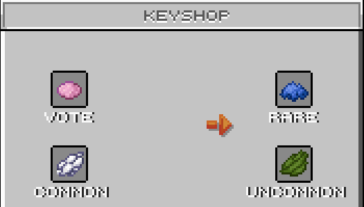
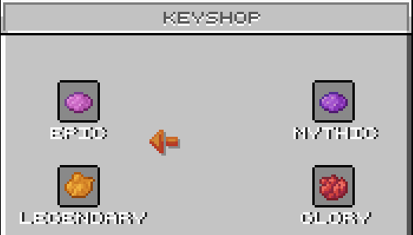

# 🗝️ keyshop

### Accessing the Keyshop

To access the Keyshop, use the command `/keyshop`. This command will open a menu where you can purchase keys for different types of crates. Each crate type requires a different number of rubies, the in-game currency, except for the Vote crate, which is only available through voting for the server.

<figure><figcaption></figcaption></figure>

<figure><figcaption></figcaption></figure>

### Crates and Pricing

Here’s a list of the available crates and the cost in rubies for each key:

1. **Common Crate**
   * **Cost:** 24 rubies
2. **Uncommon Crate**
   * **Cost:** 36 rubies
3. **Vote Crate**
   * **Availability:** Only available by voting for the server (cannot be purchased).
4. **Rare Crate**
   * **Cost:** 50 rubies
5. **Epic Crate**
   * **Cost:** 80 rubies
6. **Mythic Crate**
   * **Cost:** 120 rubies
7. **Legendary Crate**
   * **Cost:** 400 rubies
8. **Glory Crate**
   * **Special Crate**
   * **Cost:** 520 rubies

### How to Buy Keys

1. Type `/keyshop` in the chat.
2. The Keyshop menu will appear, displaying all the available crates and their corresponding key prices.
3. Click on the crate you wish to buy a key for.
4. Confirm your purchase if prompted. The appropriate number of rubies will be deducted from your balance, and the key will be added to your inventory.

### Obtaining Rubies

Rubies, the currency required to purchase keys, can be obtained through the server's store page. Visit the [Store Site](https://flamepixel.net/store) and purchase rubies using real-world money. This allows you to acquire the necessary rubies to buy keys for the crates of your choice.

### Reminding

It's important to note that crates and keys can also be earned through regular gameplay. By participating in events, completing challenges, or simply spending time on the server, you can farm the necessary items without needing to purchase anything. The system is designed to ensure that all players have a fair chance to enjoy the rewards, whether they choose to buy rubies or earn them through play.
