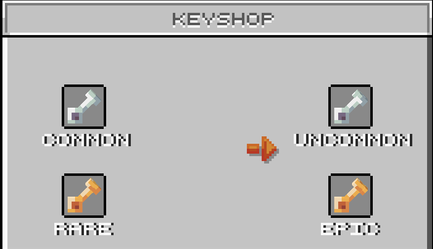

# 🗝️ keyshop

### Accessing the Keyshop

To access the Keyshop, use the command `/keyshop`. This command will open a menu where you can purchase keys for different types of crates. Each crate type requires a different number of rubies, the in-game currency, except for the Vote crate, which is only available through voting for the server.

<figure><figcaption></figcaption></figure> <figure><figcaption></figcaption></figure>

### Crates and Pricing

Here’s a list of the available crates and the cost in rubies for each key:

1. **Common Crate**
   * **Cost:** 24 rubies
2. **Uncommon Crate**
   * **Cost:** 36 rubies
3. **Rare Crate**
   * **Cost:** 50 rubies
4. **Epic Crate**
   * **Cost:** 80 rubies
5. **Vote Crate**
   * **Availability:** Only available by voting for the server (cannot be purchased).
6. **Cosmetic Crate**
   * **Cost: 115** rubies
7. **Legendary Crate**
   * **Cost: 180** rubies
8.  **Mythic Crate**

    * **Special Crate&#x20;**<mark style="color:$success;">**\[LIMITED TIME]**</mark>
    * **Cost:** **245** rubies

### How to Buy Keys

1. Type `/keyshop` in the chat.
2. The Keyshop menu will appear, displaying all the available crates and their corresponding key prices.
3. Click on the crate you wish to buy a key for.
4. Confirm your purchase if prompted. The appropriate number of rubies will be deducted from your balance, and the key will be added to your inventory.

### Obtaining Rubies

Rubies, the currency required to purchase keys, can be obtained through regular gameplay or the [<mark style="color:$primary;">store page</mark>](https://nytolia.net/store).&#x20;
