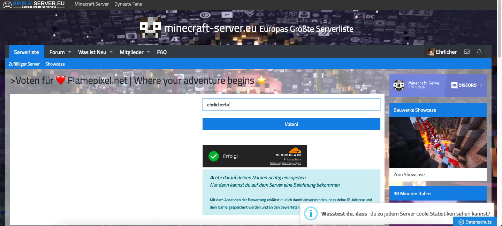

# ✉️ Voting

## How to Vote for Nytolia.net and Get Rewards

**1. Go to the Voting Page**

Visit [<mark style="color:purple;">nytolia.net/vote</mark>](https://www.nytolia.net/vote) to begin the voting process.

<figure><figcaption></figcaption></figure>

**2. Submit Your Minecraft Username**

You will be redirected to a voting site where you need to enter your Minecraft username. This is necessary to validate your vote and link it to your account.

<figure><figcaption></figcaption></figure>

**3. Receive Your Vote Key**

After successfully submitting your vote, you will receive a Vote Key. This key allows you to open a special crate in-game.

**4. Claim Your Rewards**

Log in to Flamepixel.net and use your Vote Key to open the crate. The crate contains various rewards, such as in-game currency, items, and other bonuses.

<mark style="color:red;">**Note:**</mark> Make sure to vote regularly to keep receiving rewards and support the server. If you encounter any issues or have questions, reach out to our support team on Discord or through our support page.

Thank you for supporting Nytolia.net! Enjoy your rewards and have fun in the game!
