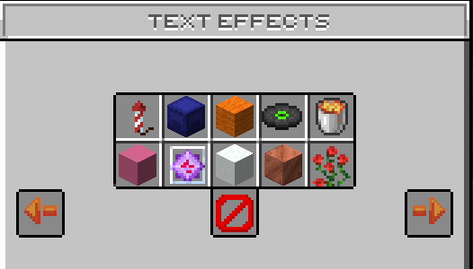

# 🌈 Name Color

<figure><figcaption></figcaption></figure>

## What are Text Effects?

On Flamepixel.net, players have the exciting option to personalize their experience by changing their name color and applying text effects. This feature allows players to stand out in the chat and express their individuality. By using special commands or accessing certain in-game items, players can select from a range of colors and effects to customize their names. Whether you want a bold red name, a cool blue one, or even animated text effects, Flamepixel.net offers the tools to make your in-game identity truly unique and vibrant.

## How do i set a Text Effect?

You can simply open the Text effect menu with /texteffects. In this menu you see many text effects that you can unlock with special ranks via [Store](https://flamepixel.net/store) or set simply with /rb you own rainbow animation.

