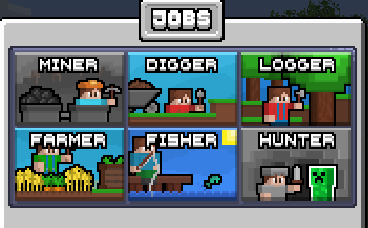

# ⏳ Job System

Flamepixel use a job system that allows players to take on specific roles to gather resources and earn rewards.

## **Joining/Leaving a Job**

To join/leave a job, you can use the following command:

```
/jobs
```

It will open a menu where you can select your job!

<figure><figcaption><p>Jobs Menu</p></figcaption></figure>

## **Earning Rewards**

Each job typically offers specific rewards and benefits based on the tasks you perform. Here’s how you can earn rewards:

* **Money:** Many servers have an in-game economy where you earn currency by completing job-related tasks. For example, a Miner earns money by mining ores and selling them.
* **Experience Points (XP):** Completing job tasks can also reward you with experience points, which are useful for enchanting items and advancing skills.
* **Items and Resources:** Some jobs reward you with special items or resources that are valuable for crafting or trading.


**Job Descriptions:**

1. **Miner:** As a miner, your primary responsibility is to explore and extract valuable resources from the depths of the earth. You will dig through caves and mine shafts to collect essential ores like coal, iron, gold, and diamonds. Your work is crucial for providing the raw materials needed for crafting tools, armor, and other essential items. Miners must navigate through various underground hazards, including lava pools and hostile mobs, while maximizing their resource yield. Efficient mining and strategic exploration are key to your success in this role.
2. **Digger:** The digger’s job involves excavating large areas of land to gather materials such as dirt, sand, gravel, and clay. This role is fundamental for clearing space for construction projects, creating foundations, and preparing landscapes. As a digger, you will use shovels and other tools to quickly and effectively remove large quantities of material. Your work supports various building and landscaping projects, helping to shape and develop the world around you. Proper management of resources and efficient excavation techniques are essential for maximizing productivity.
3. **Logger:** As a logger, you are responsible for harvesting wood from trees across different biomes. This involves chopping down trees to collect logs, which are essential for crafting and building. You will manage forests by replanting saplings and ensuring sustainable logging practices to maintain a steady supply of wood. The resources you gather support a wide range of community activities, from building structures to crafting tools and furniture. Your role is critical in maintaining a balance between resource extraction and environmental stewardship.
4. **Farmer:** The farmer’s role involves cultivating crops and raising animals to produce food and other resources. You will plant, grow, and harvest various crops such as wheat, carrots, potatoes, and more. Additionally, you will care for livestock including cows, pigs, and chickens, providing them with the necessary food and shelter. Farmers play a vital role in ensuring a steady supply of food, which is essential for the survival and well-being of the community. Your work also includes managing farmland, improving crop yields, and contributing to the overall agricultural development of your world.
5. **Fisher:** As a fisher, you will focus on catching fish from rivers, lakes, and oceans. Using a fishing rod, you will reel in a variety of fish and other aquatic resources. This role provides a valuable source of food and ingredients, which are essential for maintaining a balanced diet and crafting recipes. Fishermen must be skilled in locating good fishing spots and adapting to different water environments. Your catch not only supports the community’s food supply but also contributes to trading and other economic activities.
6. **Hunter:** The hunter’s job is to track and hunt wild animals in various biomes for their meat, hides, and feathers. This role requires exploring different terrains and using weapons such as bows and swords to take down mobs. Hunters provide essential resources for crafting, cooking, and trading, contributing to the community’s survival and economy. Your skills in tracking, combat, and resource collection are crucial for ensuring a steady supply of valuable materials. Effective hunting also involves understanding animal behavior and adapting your strategies to different environments.
